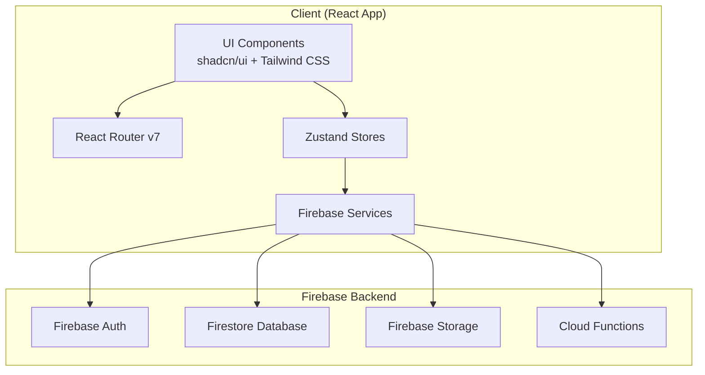
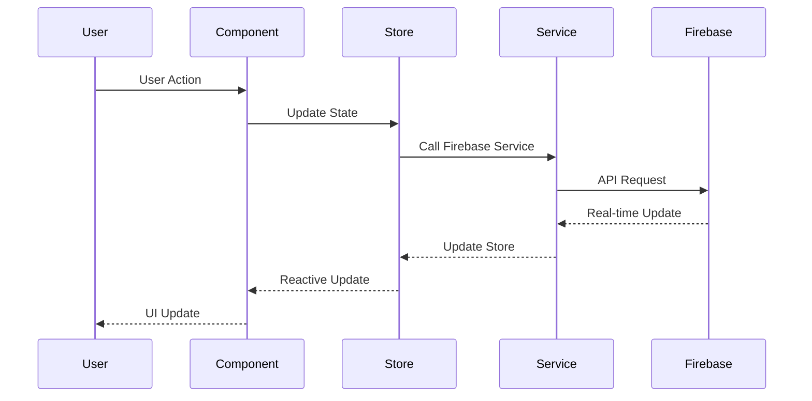

# Design Document

## Overview

The core garden management system will be built as a React-based single-page application using React Router v7 for navigation, Zustand for client-side state management, and Firebase as the backend-as-a-service platform. The architecture follows a modular component-based design with clear separation between UI components, business logic, and data access layers.

The system will leverage Firebase's real-time capabilities to provide immediate updates across user sessions, while maintaining offline functionality through Firebase's built-in persistence mechanisms. The design emphasizes user experience with responsive layouts using Tailwind CSS and accessible, pre-built components from shadcn/ui, which provides a comprehensive set of copy-paste components built on top of Radix UI primitives.

## Architecture

### UI Library Choice: shadcn/ui

The application will use **shadcn/ui** as the primary UI component library, which provides:

- **Accessible Components**: Built on Radix UI primitives with full keyboard navigation and screen reader support
- **Customizable Design System**: Components are copy-paste friendly and fully customizable with Tailwind CSS
- **TypeScript Support**: Full TypeScript support with proper type definitions
- **Modern Styling**: Uses CSS-in-JS with Tailwind CSS for consistent, responsive design
- **Developer Experience**: Easy to integrate, modify, and extend components as needed

Key shadcn/ui components we'll utilize:
- **Forms**: `Form`, `Input`, `Label`, `Button`, `Select`, `Textarea`, `Checkbox`
- **Navigation**: `NavigationMenu`, `Breadcrumb`, `Tabs`
- **Data Display**: `Card`, `Table`, `Badge`, `Avatar`, `Progress`
- **Feedback**: `Alert`, `Toast`, `Dialog`, `AlertDialog`
- **Layout**: `Sheet`, `Separator`, `ScrollArea`
- **Loading States**: `Skeleton`, `Spinner`
- **Date/Time**: `Calendar`, `DatePicker` (via additional shadcn/ui extensions)

**Why shadcn/ui?**
- Aligns with our existing Tailwind CSS setup
- Provides accessible components out of the box (WCAG compliant)
- Copy-paste approach allows full customization without package dependencies
- Excellent TypeScript support and React 19 compatibility
- Active community and regular updates
- Integrates seamlessly with React Hook Form for form validation

### High-Level Architecture



### Data Flow Architecture



## Components and Interfaces

### Core Components Structure

```
app/
├── components/
│   ├── ui/                     # shadcn/ui base components
│   ├── layout/
│   │   ├── AppLayout.tsx       # Main app layout with navigation
│   │   ├── AuthLayout.tsx      # Authentication pages layout
│   │   └── Sidebar.tsx         # Navigation sidebar
│   ├── spaces/
│   │   ├── SpaceCard.tsx       # Individual space display
│   │   ├── SpaceForm.tsx       # Create/edit space form
│   │   ├── SpaceList.tsx       # List of user's spaces
│   │   └── SpaceDetails.tsx    # Detailed space view
│   ├── plants/
│   │   ├── PlantCard.tsx       # Individual plant display
│   │   ├── PlantForm.tsx       # Create/edit plant form
│   │   ├── PlantList.tsx       # Plants within a space
│   │   └── PlantDetails.tsx    # Detailed plant view
│   ├── notes/
│   │   ├── NoteCard.tsx        # Individual note display
│   │   ├── NoteForm.tsx        # Create/edit note form
│   │   ├── NoteList.tsx        # List of notes
│   │   └── PhotoUpload.tsx     # Photo attachment component
│   ├── tasks/
│   │   ├── TaskCard.tsx        # Individual task display
│   │   ├── TaskForm.tsx        # Create/edit task form
│   │   ├── TaskList.tsx        # List of tasks
│   │   └── TaskCalendar.tsx    # Calendar view of tasks
│   └── auth/
│       ├── LoginForm.tsx       # Login component
│       ├── RegisterForm.tsx    # Registration component
│       └── ProfileForm.tsx     # User profile management
├── lib/
│   ├── firebase/
│   │   ├── config.ts           # Firebase configuration
│   │   ├── auth.ts             # Authentication utilities
│   │   ├── firestore.ts        # Firestore utilities
│   │   └── storage.ts          # Storage utilities
│   ├── services/
│   │   ├── authService.ts      # Authentication service
│   │   ├── spaceService.ts     # Space management service
│   │   ├── plantService.ts     # Plant management service
│   │   ├── noteService.ts      # Note management service
│   │   └── taskService.ts      # Task management service
│   ├── hooks/
│   │   ├── useAuth.ts          # Authentication hook
│   │   ├── useSpaces.ts        # Spaces data hook
│   │   ├── usePlants.ts        # Plants data hook
│   │   └── useRealtime.ts      # Real-time updates hook
│   └── types/
│       ├── auth.ts             # Authentication types
│       ├── space.ts            # Space-related types
│       ├── plant.ts            # Plant-related types
│       ├── note.ts             # Note-related types
│       └── task.ts             # Task-related types
├── stores/
│   ├── authStore.ts            # Authentication state
│   ├── spaceStore.ts           # Spaces state management
│   ├── plantStore.ts           # Plants state management
│   ├── noteStore.ts            # Notes state management
│   └── taskStore.ts            # Tasks state management
└── routes/
    ├── auth/
    │   ├── login.tsx           # Login page
    │   └── register.tsx        # Registration page
    ├── dashboard.tsx           # Main dashboard
    ├── spaces/
    │   ├── index.tsx           # Spaces overview
    │   ├── $spaceId.tsx        # Individual space view
    │   └── new.tsx             # Create new space
    ├── plants/
    │   ├── $plantId.tsx        # Individual plant view
    │   └── new.tsx             # Add new plant
    └── profile.tsx             # User profile page
```

### Key Interfaces

#### Core Data Models

```typescript
// User Profile
interface User {
  uid: string;
  email: string;
  displayName: string;
  preferences: UserPreferences;
  createdAt: Date;
  updatedAt: Date;
}

interface UserPreferences {
  defaultUnits: 'metric' | 'imperial';
  timezone: string;
  notifications: NotificationSettings;
}

// Grow Space
interface GrowSpace {
  id: string;
  userId: string;
  name: string;
  type: 'indoor-tent' | 'outdoor-bed' | 'greenhouse' | 'hydroponic' | 'container';
  description?: string;
  dimensions?: SpaceDimensions;
  environment?: EnvironmentSettings;
  plantCount: number;
  createdAt: Date;
  updatedAt: Date;
}

// Plant
interface Plant {
  id: string;
  spaceId: string;
  userId: string;
  name: string;
  variety: string;
  seedSource?: string;
  plantedDate: Date;
  expectedHarvestDate?: Date;
  actualHarvestDate?: Date;
  status: 'seedling' | 'vegetative' | 'flowering' | 'harvested' | 'removed';
  notes?: string;
  createdAt: Date;
  updatedAt: Date;
}

// Note/Log Entry
interface Note {
  id: string;
  userId: string;
  plantId?: string;
  spaceId?: string;
  content: string;
  category: 'observation' | 'feeding' | 'pruning' | 'issue' | 'milestone' | 'general';
  photos: string[];
  timestamp: Date;
  createdAt: Date;
}

// Task
interface Task {
  id: string;
  userId: string;
  plantId?: string;
  spaceId?: string;
  title: string;
  description?: string;
  dueDate: Date;
  priority: 'low' | 'medium' | 'high';
  status: 'pending' | 'completed';
  recurrence?: RecurrenceSettings;
  completedAt?: Date;
  createdAt: Date;
  updatedAt: Date;
}
```

#### Service Interfaces

```typescript
// Authentication Service
interface AuthService {
  signUp(email: string, password: string, displayName: string): Promise<User>;
  signIn(email: string, password: string): Promise<User>;
  signOut(): Promise<void>;
  resetPassword(email: string): Promise<void>;
  updateProfile(updates: Partial<User>): Promise<void>;
  getCurrentUser(): User | null;
  onAuthStateChanged(callback: (user: User | null) => void): () => void;
}

// Data Service Base
interface BaseService<T> {
  create(data: Omit<T, 'id' | 'createdAt' | 'updatedAt'>): Promise<T>;
  getById(id: string): Promise<T | null>;
  update(id: string, updates: Partial<T>): Promise<T>;
  delete(id: string): Promise<void>;
  list(filters?: QueryFilters): Promise<T[]>;
  subscribe(callback: (items: T[]) => void, filters?: QueryFilters): () => void;
}
```

## Data Models

### Firestore Collections Structure

```
users/{userId}
├── profile: UserProfile
└── preferences: UserPreferences

spaces/{spaceId}
├── userId: string
├── name: string
├── type: SpaceType
├── description?: string
├── dimensions?: SpaceDimensions
├── plantCount: number (computed)
└── timestamps

plants/{plantId}
├── userId: string
├── spaceId: string
├── name: string
├── variety: string
├── plantedDate: Date
├── status: PlantStatus
└── timestamps

notes/{noteId}
├── userId: string
├── plantId?: string
├── spaceId?: string
├── content: string
├── category: NoteCategory
├── photos: string[]
└── timestamp: Date

tasks/{taskId}
├── userId: string
├── plantId?: string
├── spaceId?: string
├── title: string
├── dueDate: Date
├── status: TaskStatus
├── recurrence?: RecurrenceSettings
└── timestamps

photos/{photoId}
├── userId: string
├── noteId: string
├── filename: string
├── storagePath: string
├── metadata: PhotoMetadata
└── uploadedAt: Date
```

### Security Rules Strategy

```javascript
// Firestore Security Rules
rules_version = '2';
service cloud.firestore {
  match /databases/{database}/documents {
    // Users can only access their own data
    match /spaces/{spaceId} {
      allow read, write: if request.auth != null && 
        request.auth.uid == resource.data.userId;
    }
    
    match /plants/{plantId} {
      allow read, write: if request.auth != null && 
        request.auth.uid == resource.data.userId;
    }
    
    match /notes/{noteId} {
      allow read, write: if request.auth != null && 
        request.auth.uid == resource.data.userId;
    }
    
    match /tasks/{taskId} {
      allow read, write: if request.auth != null && 
        request.auth.uid == resource.data.userId;
    }
  }
}
```

## Error Handling

### Error Handling Strategy

1. **Firebase Errors**: Wrap all Firebase operations in try-catch blocks with specific error handling for common scenarios (network errors, permission denied, etc.)

2. **Form Validation**: Use React Hook Form with Zod schemas for client-side validation before Firebase operations

3. **Network Resilience**: Leverage Firebase's offline persistence and implement loading states with retry mechanisms

4. **User Feedback**: Provide clear error messages and success notifications using toast components

5. **Error Boundaries**: Implement React Error Boundaries to catch and handle component-level errors gracefully

### Error Types and Handling

```typescript
// Error handling utilities
interface AppError {
  code: string;
  message: string;
  details?: any;
}

class ErrorHandler {
  static handleFirebaseError(error: FirebaseError): AppError {
    switch (error.code) {
      case 'auth/user-not-found':
        return { code: 'AUTH_USER_NOT_FOUND', message: 'User not found' };
      case 'auth/wrong-password':
        return { code: 'AUTH_INVALID_CREDENTIALS', message: 'Invalid credentials' };
      case 'permission-denied':
        return { code: 'PERMISSION_DENIED', message: 'Access denied' };
      default:
        return { code: 'UNKNOWN_ERROR', message: 'An unexpected error occurred' };
    }
  }
}
```

## Testing Strategy

### Testing Approach

1. **Unit Tests**: Test individual components, services, and utilities using Vitest and React Testing Library
2. **Integration Tests**: Test component interactions with Zustand stores and Firebase services
3. **E2E Tests**: Test complete user workflows using Playwright (to be added)
4. **Firebase Emulator**: Use Firebase emulator suite for testing Firebase integrations locally

### Test Structure

```
app/test/
├── __mocks__/
│   ├── firebase.ts           # Firebase mocks
│   └── zustand.ts            # Zustand store mocks
├── components/
│   ├── spaces/               # Space component tests
│   ├── plants/               # Plant component tests
│   └── auth/                 # Auth component tests
├── services/
│   ├── authService.test.ts   # Auth service tests
│   └── spaceService.test.ts  # Space service tests
├── stores/
│   ├── authStore.test.ts     # Auth store tests
│   └── spaceStore.test.ts    # Space store tests
└── utils/
    └── testUtils.tsx         # Test utilities and providers
```

### Testing Configuration

```typescript
// Test setup with Firebase emulator
beforeAll(async () => {
  // Connect to Firebase emulator
  connectAuthEmulator(auth, 'http://localhost:9099');
  connectFirestoreEmulator(firestore, 'localhost', 8080);
});

// Test wrapper with providers
export const TestWrapper = ({ children }: { children: React.ReactNode }) => (
  <BrowserRouter>
    <AuthProvider>
      {children}
    </AuthProvider>
  </BrowserRouter>
);
```

This design provides a solid foundation for the core garden management functionality while maintaining scalability for future AI/ML features. The modular architecture allows for easy testing and maintenance, while Firebase integration ensures reliable data persistence and real-time updates.